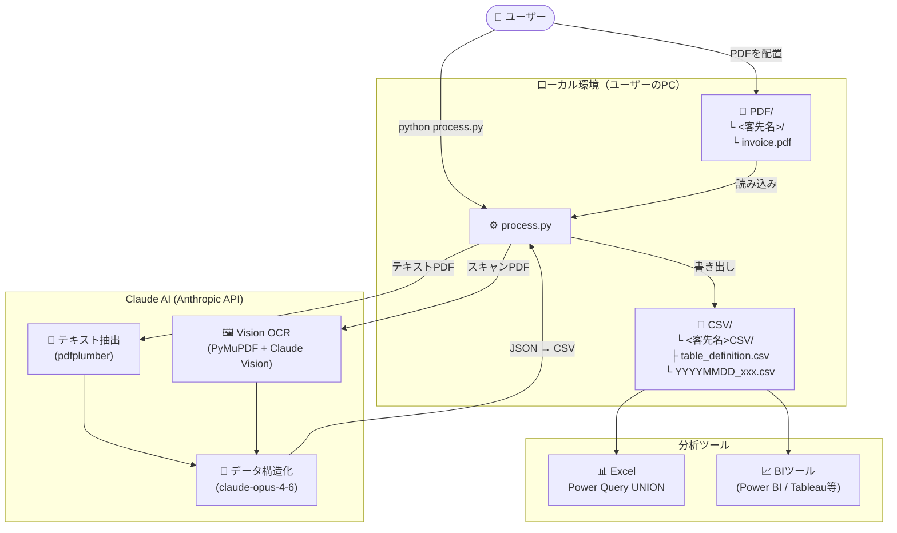

# PDF2CSV — 請求書PDF 自動CSV変換ツール

---

<!-- ============================================================ -->
<!-- 👤 ユーザー向け                                               -->
<!-- ============================================================ -->

# 👤 ご利用ガイド（一般ユーザー向け）

> IT知識がなくても使えるよう、手順を順番に説明しています。

## このツールでできること

取引先から届いた **請求書のPDFファイル** を所定のフォルダに入れてボタンを押すだけで、  
**ExcelやBIツールで集計できるCSVファイル** に自動で変換します。

- 普通のPDF（テキストが入ったもの）も、**スキャンしたPDF（画像のもの）** も読み取れます
- 客先ごとに整理して保存されます
- 毎月のデータが蓄積され、まとめて集計できます

---

## 仕組みのイメージ

このツールは **あなたのパソコンの中で動きます**。  
クラウドにデータをアップロードするサービスではなく、  
PDFの読み取りだけ AI（Claude）にインターネット経由で依頼する構成です。

```
あなたのパソコン
┌──────────────────────────────────────────────────────┐
│                                                      │
│  📁 PDFフォルダ          📁 CSVフォルダ              │
│  └─ 株式会社A/           └─ 株式会社ACSV/            │
│     └─ 請求書.pdf  ──→     └─ 20260415_請求書.csv   │
│                    ↑                                 │
│              process.py が変換                       │
│                                                      │
└──────────────────────────┬───────────────────────────┘
                           │ PDFの内容を送信（読み取り依頼）
                           ▼
               🌐 Claude AI（Anthropic社のサービス）
                  ※ 請求書の文字を読み取って返してくれる
```

> **PDFファイル自体はパソコンの外に出ません。**  
> Claude AI に送られるのは「このPDFを読み取って」という指示とPDFの内容のみです。

---

## はじめる前に準備するもの

| 必要なもの | 説明 |
|-----------|------|
| **Windows / Mac パソコン** | インターネットに接続できること |
| **Python（無料）** | ツールを動かすソフトウェア。インストーラーが確認します |
| **Anthropic APIキー** | AIの利用に必要な「鍵」。取得方法は下記参照 |

### Anthropic APIキーの取得方法

1. https://console.anthropic.com/settings/keys をブラウザで開く
2. Anthropic のアカウントを作成してログイン
3. 「Create Key」ボタンを押してキーを生成
4. `sk-ant-` で始まる文字列をコピーしておく

> **料金について：** APIは従量課金です。請求書1件あたりの目安は数円〜数十円程度です。  
> 月の上限金額も設定できます（Anthropicのコンソール画面から設定可能）。

---

## セットアップ手順（初回のみ）

### ステップ 1：ZIPファイルをダウンロードする

以下のリンクを開き、ZIPファイルをダウンロードします。

**→ https://github.com/ganase/pdf2csv/archive/refs/heads/main.zip**

または GitHub のページ（ https://github.com/ganase/pdf2csv ）を開いて、  
緑色の **「Code」** ボタン → **「Download ZIP」** をクリックしても同じです。

---

### ステップ 2：ZIPファイルを解凍する

ダウンロードした `pdf2csv-main.zip` を **使いやすい場所に移動** してから解凍します。

> 場所の例：`C:\作業\` や `デスクトップ` など

**解凍の手順（Windows 11）：**

1. `pdf2csv-main.zip` を右クリック
2. **「すべて展開」** をクリック
3. 展開先のフォルダを確認して **「展開」** をクリック

解凍すると `pdf2csv-main` というフォルダができます。

```
C:\作業\
└── pdf2csv-main\        ← 解凍してできたフォルダ
    ├── setup.bat        ← 次のステップで使う
    ├── installer.py
    ├── process.py
    └── ...
```

---

### ステップ 3：Python をインストールする（まだの場合）

`setup.bat` を実行すると Python が入っているか自動で確認します。  
**まだ入っていない場合は自動でブラウザが開き、案内が表示されます。**

Python を手動でインストールする場合は以下の手順で行ってください。

1. https://www.python.org/downloads/ を開く
2. **「Download Python」** ボタンを押してインストーラーをダウンロード
3. インストーラーを起動し、**「Add Python to PATH」** に必ずチェックを入れる  
   （これを忘れると動きません）
4. **「Install Now」** をクリックしてインストール完了

---

### ステップ 4：setup.bat を実行する

解凍してできた `pdf2csv-main` フォルダの中の **`setup.bat`** をダブルクリックします。

**▼ Python が見つからない場合（インストールが必要）**

```
[エラー] Python が見つかりませんでした。

PDF2CSV を使うには Python 3.10 以上が必要です。
 1. https://www.python.org/downloads/ を開く
 2. 「Download Python」ボタンでインストーラーをダウンロード
 3. 「Add Python to PATH」にチェックを入れてインストール
 4. 完了後、setup.bat をもう一度実行してください
```

ブラウザが自動で開きます。Pythonをインストールしてから `setup.bat` を再実行してください。

**▼ Python が入っていれば、セットアップ画面が自動で起動します**

```
┌──────────────────────────────────────────────────────────┐
│  PDF2CSV セットアップウィザード                           │
│  ステップ 1 / 6  —  ようこそ                             │
├──────────────────────────────────────────────────────────┤
│  ① ようこそ         … ツールの説明                      │
│  ② Pythonの確認     … Python が入っているか自動確認     │
│  ③ パッケージ       … 必要なソフトを自動インストール    │
│  ④ APIキーの設定    … 取得したキーを貼り付けて保存      │
│  ⑤ フォルダの設定   … 作業フォルダを選ぶ               │
│  ⑥ 完了            … 準備完了！フォルダが開きます      │
└──────────────────────────────────────────────────────────┘
```

ウィザードの指示に従って進めると、以下のフォルダが自動で作られます。

```
pdf2csv-main\
├── PDF\     ← ここに請求書PDFを入れる（次のセクション参照）
├── CSV\     ← 変換されたCSVが自動で保存される
└── .env     ← APIキーが保存されたファイル（触らなくてOK）
```

---

## 毎回の使い方

### 手順 1：PDFを所定のフォルダに入れる

`PDF` フォルダの中に、**客先名のフォルダ** を作って請求書PDFを入れます。

```
PDF/
├── 株式会社ABC/
│   ├── 請求書_2026-03.pdf
│   └── 請求書_2026-04.pdf
└── 有限会社XYZ/
    └── 請求書_2026-04.pdf
```

### 手順 2：変換を実行する

コマンドプロンプト（またはターミナル）を開いて、以下を入力します。

```
cd （作業フォルダのパス）
python process.py
```

しばらく待つと、`CSV` フォルダに変換済みファイルが出来上がります。

### 手順 3：CSVを確認する

```
CSV/
├── 株式会社ABCCSV/
│   ├── table_definition.csv   ← 列の定義書（自動生成）
│   ├── 20260401_請求書_2026-03.csv
│   └── 20260415_請求書_2026-04.csv
└── 有限会社XYZCSV/
    └── 20260415_請求書_2026-04.csv
```

---

## よくある質問

**Q. 同じPDFを2回処理してしまうと？**  
A. 同名の出力CSVがある場合は自動でスキップされます。安心してください。

**Q. 新しい種類の項目が請求書に出てきたら？**  
A. 列が自動で追加されます。過去のCSVにも空欄として追記されます。

**Q. スキャンした（画像の）請求書PDFでも使えますか？**  
A. 使えます。自動的に画像として読み取り処理します。

**Q. PDFのデータは外部に保存されますか？**  
A. PDFの内容（文字・画像）はAI読み取りのためにAnthropicのAPIに送られますが、  
　 ファイル自体はパソコン外に保存されません。

---
---

<!-- ============================================================ -->
<!-- 🛠️ エンジニア向け                                            -->
<!-- ============================================================ -->

# 🛠️ 技術資料（エンジニア向け）

## システム構成図



## リポジトリ構成

```
pdf2csv/
├── process.py          # 変換処理本体
├── installer.py        # GUIセットアップウィザード（tkinter）
├── requirements.txt    # 依存パッケージ
├── .env.example        # APIキー設定テンプレート
├── .gitignore          # PDF/ CSV/ .env を除外
└── README.md
```

## 処理フロー詳細

```
process.py 起動
│
├─ PDF/<客先名>/ を走査
│
├─ 各PDFに対して
│   ├─ pdfplumber でテキスト抽出を試みる
│   │   ├─ 成功（テキストPDF）→ Claude API にテキストを送信
│   │   └─ 失敗（スキャンPDF）→ PyMuPDF で 2× 解像度PNG化
│   │                            → Claude Vision API に送信
│   │
│   └─ claude-opus-4-6 が JSON 配列（明細行単位）を返す
│
├─ CSV/<客先名>CSV/ に出力
│   ├─ 初回: table_definition.csv を自動生成
│   └─ 2回目以降: 定義書を参照して列順を統一
│       └─ 新列が出現した場合: 定義書更新 + 既存CSVに空列追加
│
└─ 完了
```

## セットアップ（手動）

```bash
# git clone
git clone https://github.com/ganase/pdf2csv.git
cd pdf2csv

# または ZIP 展開後のフォルダに移動
cd pdf2csv-main

pip install -r requirements.txt
cp .env.example .env   # Windows: copy .env.example .env
# .env に ANTHROPIC_API_KEY を設定
```

## 実行オプション

```bash
python process.py                        # 全客先を処理
python process.py --client 株式会社ABC  # 特定客先のみ
python process.py --force               # 処理済みも再処理
python process.py --pdf-dir ./PDF --csv-dir ./CSV  # パス明示
```

## 出力CSVスキーマ

| 列名 | 型 | 内容 |
|------|----|------|
| `source_file` | str | 元PDFファイル名 |
| `processed_date` | date | 処理日 (YYYY-MM-DD) |
| `client_name` | str | 客先名（フォルダ名） |
| `billing_month` | str | 請求月 (YYYY-MM) |
| `recipient` | str | 宛先名 |
| `item_no` | int | 明細番号 |
| `item_description` | str | 明細項目 |
| `quantity` | num | 数量 |
| `unit` | str | 単位 |
| `unit_price` | num | 単価 |
| `amount` | num | 金額 |
| `tax` | num | 消費税 |
| `subtotal` | num | 小計 |
| `total` | num | 合計 |
| `remarks` | str | 備考 |

> 未知の列はClaudeの抽出結果に応じて自動追加。既存CSVに空列として遡及追加される。

## BIツール・Excelでの UNION 集計

同一客先の全CSVは同じ列構造で出力されるため、フォルダ指定だけで UNION できます。

**Excel（Power Query）**

1. `データ` → `データの取得` → `ファイルから` → `フォルダーから`
2. `CSV/<客先名>CSV/` を選択
3. 「バイナリの結合」→ `table_definition.csv` を除外

**Power BI**

1. `データを取得` → `フォルダー`
2. `CSV/<客先名>CSV/` を指定し `table_definition.csv` をフィルタ除外

## テーブル定義書 (`table_definition.csv`)

初回処理時に自動生成。以降の処理で列順・列名の基準となる。

| 列 | 内容 |
|----|------|
| `column_name` | 列名 |
| `description` | 説明（自動付与） |
| `example` | 記入例（任意・手動） |

新列が増えた場合：定義書末尾に追記 → 既存CSVに空列を遡及追加。

## 動作環境

| 項目 | 要件 |
|------|------|
| Python | 3.10 以上 |
| OS | Windows / macOS / Linux |
| API | Anthropic API (`claude-opus-4-6`) |

## ライセンス

MIT
