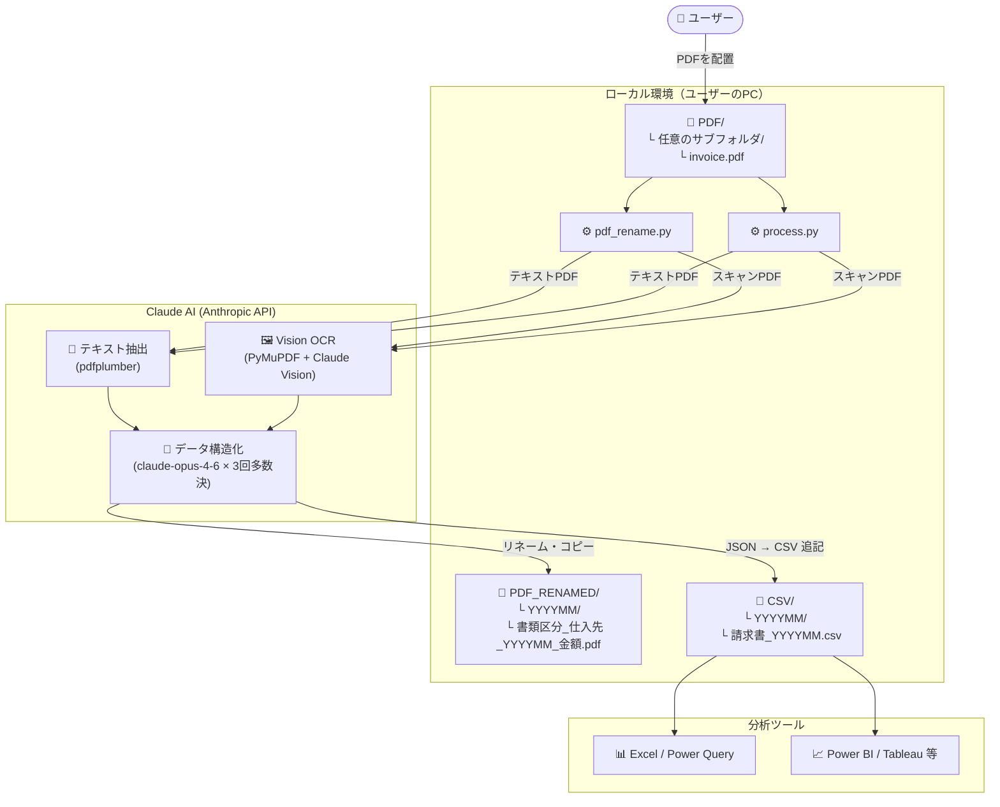

# PDF2CSV — 請求書PDF 自動整理・CSV変換ツール

---

<!-- ============================================================ -->
<!-- 👤 ユーザー向け                                               -->
<!-- ============================================================ -->

# 👤 ご利用ガイド（一般ユーザー向け）

> IT知識がなくても使えるよう、手順を順番に説明しています。

## このツールでできること

取引先から届いた **PDFファイル（請求書・注文書など）** を所定のフォルダに入れてダブルクリックするだけで、

1. **PDFを自動でリネーム・月別フォルダに整理**（`pdf_rename.bat`）
2. **内容をCSVに変換して月別フォルダに集約**（`process.bat`）

の2つの処理が実行できます。

- 普通のPDF（テキスト入り）も、**スキャンしたPDF（画像）** も読み取れます
- 請求書・注文書・見積書など書類の種類を自動で判別します
- 月ごとのフォルダにまとめて保存されるので、あとから集計しやすい構造になります

---

## 仕組みのイメージ

このツールは **あなたのパソコンの中で動きます**。  
PDFの読み取りだけ AI（Claude）にインターネット経由で依頼する構成です。

```
あなたのパソコン
┌─────────────────────────────────────────────────────────────────┐
│                                                                 │
│  📁 PDF/（元ファイル置き場）                                    │
│  └─ 仕入先A/請求書.pdf  ─┐                                     │
│  └─ 仕入先B/注文書.pdf  ─┤                                     │
│                           ↓                                     │
│             pdf_rename.py が読み取り・コピー                    │
│                           ↓                                     │
│  📁 PDF_RENAMED/（リネーム済みコピー）                          │
│  └─ 202604/                                                     │
│     └─ 請求書_株式会社A_202604_110000.pdf                       │
│     └─ 注文書_有限会社B_202604_.pdf                             │
│                                                                 │
│             process.py が内容をCSV化                            │
│                           ↓                                     │
│  📁 CSV/（変換結果）                                            │
│  └─ 202604/                                                     │
│     └─ 請求書_202604.csv  ← 同月の全PDF分が1ファイルに集約     │
│                                                                 │
└───────────────────────────┬─────────────────────────────────────┘
                            │ PDFの内容を送信（読み取り依頼）
                            ▼
                🌐 Claude AI（Anthropic社のサービス）
```

> **PDFファイル自体はパソコンの外に保存されません。**  
> Claude AI に送られるのは「このPDFを読み取って」という指示とPDFの内容のみです。

---

## はじめる前に準備するもの

| 必要なもの | 説明 |
|-----------|------|
| **Windows / Mac パソコン** | インターネットに接続できること |
| **Python（無料）** | ツールを動かすソフトウェア |
| **Anthropic APIキー** | AIの利用に必要な「鍵」。取得方法は下記参照 |

### Anthropic APIキーの取得方法

1. https://console.anthropic.com/settings/keys をブラウザで開く
2. Anthropic のアカウントを作成してログイン
3. 「Create Key」ボタンを押してキーを生成
4. `sk-ant-` で始まる文字列をコピーしておく

> **料金について：** APIは従量課金です。1件あたりの目安は数円〜数十円程度です。  
> 月の上限金額も設定できます（Anthropicのコンソール画面から設定可能）。

---

## セットアップ手順（初回のみ）

### ステップ 1：ZIPファイルをダウンロードする

**→ https://github.com/ganase/pdf2csv/archive/refs/heads/main.zip**

または GitHub のページ（ https://github.com/ganase/pdf2csv ）を開いて、  
緑色の **「Code」** ボタン → **「Download ZIP」** をクリックしても同じです。

---

### ステップ 2：ZIPファイルを解凍する

ダウンロードした `pdf2csv-main.zip` を使いやすい場所に移動してから解凍します。

**解凍の手順（Windows 11）：**

1. `pdf2csv-main.zip` を右クリック
2. **「すべて展開」** をクリック
3. 展開先のフォルダを確認して **「展開」** をクリック

---

### ステップ 3：Python をインストールする（まだの場合）

1. https://www.python.org/downloads/ を開く
2. **「Download Python」** ボタンを押してインストーラーをダウンロード
3. インストーラーを起動し、**「Add Python to PATH」** に必ずチェックを入れる
4. **「Install Now」** をクリック

---

### ステップ 4：セットアップを実行する

解凍したフォルダの中の **`setup.bat`** をダブルクリックします。  
ウィザードの指示に従うと、必要なソフトのインストールとAPIキーの設定が完了します。

完了すると以下のフォルダ・ファイルが作られます。

```
pdf2csv-main\
├── PDF\          ← ここにPDFを入れる
├── PDF_RENAMED\  ← リネーム済みPDFのコピーが保存される
├── CSV\          ← 変換されたCSVが保存される
└── .env          ← APIキーが保存されたファイル（触らなくてOK）
```

---

## 毎回の使い方

### 【機能1】PDFのリネーム・月別整理

#### 手順 1：PDFをフォルダに入れる

`PDF` フォルダの中に、仕入先名などのサブフォルダを作ってPDFを入れます。  
フォルダ構造は自由です（サブフォルダがなくても動きます）。

```
PDF/
├── 株式会社ABC/
│   └── 請求書_2026-04.pdf
└── 有限会社XYZ/
    └── 注文書_2026-04.pdf
```

#### 手順 2：pdf_rename.bat をダブルクリック（Macは pdf_rename.command）

しばらく待つと `PDF_RENAMED` フォルダに整理済みのコピーが出来上がります。

```
PDF_RENAMED/
└── 202604/
    ├── 請求書_株式会社ABC_202604_110000.pdf
    └── 注文書_有限会社XYZ_202604_.pdf
```

**ファイル名の形式：** `書類区分_仕入先名_YYYYMM_税込金額.pdf`

- 読み取れなかった・年月が不正だったファイルは `失敗_元のファイル名.pdf` として同じフォルダに保存されます
- オリジナルの PDF は変更されません

---

### 【機能2】PDF → CSV 変換

#### 手順 1：process.bat をダブルクリック（Macは process.command）

`PDF` フォルダ内の全PDFを読み取り、月別にまとめたCSVを出力します。

```
CSV/
└── 202604/
    └── 請求書_202604.csv  ← 同月の全PDF分が1ファイルに集約
```

同じPDFは2回目以降自動でスキップされます。

#### 出力CSVの列

| 列名 | 内容 |
|------|------|
| 処理日 | 変換を実行した日付 |
| 元ファイル名 | 元のPDFファイル名 |
| 仕入先名 | 請求元・発行元の会社名 |
| 請求年月 | YYYY-MM 形式 |
| 書類区分 | 請求書・注文書・見積書・納品書・領収書・その他 |
| 明細番号 | 明細の行番号 |
| 品目・摘要 | 明細の内容 |
| 数量 | 明細の数量 |
| 単位 | 個・式・時間など |
| 単価 | 明細の単価 |
| 金額 | 明細の金額 |
| 消費税 | 消費税額（明細行にある場合） |
| 合計（税込） | 書類全体の税込合計 |
| 備考 | 備考欄 |

---

## よくある質問

**Q. 同じPDFを2回処理してしまうと？**  
A. `process.bat` は同じファイル名がCSVに記録済みの場合、自動でスキップします。`pdf_rename.bat` も同名ファイルがあればスキップします。

**Q. 読み取りに失敗したファイルはどうなりますか？**  
A. `PDF_RENAMED/<年月>/失敗_元のファイル名.pdf` として保存されます。年月も不明な場合は `PDF_RENAMED/不明/` に保存されます。

**Q. スキャンした（画像の）PDFでも使えますか？**  
A. 使えます。自動的に画像として読み取り処理します。

**Q. PDFのデータは外部に保存されますか？**  
A. PDFの内容（文字・画像）はAI読み取りのためにAnthropicのAPIに送られますが、ファイル自体はパソコン外に保存されません。

**Q. APIキーがGitHubに漏れる心配はありますか？**  
A. `.env` ファイルは `.gitignore` で除外されており、GitHubには絶対にアップロードされません。

---
---

<!-- ============================================================ -->
<!-- 🛠️ エンジニア向け                                            -->
<!-- ============================================================ -->

# 🛠️ 技術資料（エンジニア向け）

## リポジトリ構成

```
pdf2csv/
├── process.py          # PDF → CSV 変換本体
├── pdf_rename.py       # PDF リネーム・月別整理本体
├── process.bat         # process.py の Windows 起動用
├── process.command     # process.py の Mac 起動用
├── pdf_rename.bat      # pdf_rename.py の Windows 起動用
├── pdf_rename.command  # pdf_rename.py の Mac 起動用
├── installer.py        # GUI セットアップウィザード（tkinter）
├── setup.bat           # Windows セットアップ起動用
├── requirements.txt    # 依存パッケージ
├── .env.example        # APIキー設定テンプレート
├── .gitignore          # PDF/ CSV/ PDF_RENAMED/ .env を除外
└── README.md
```

## システム構成図



## 処理フロー

### pdf_rename.py

```
起動
│
├─ PDF/ 以下を再帰的に走査（samples/ フォルダは除外）
│
├─ 各PDFに対して Claude を3回呼び出し（多数決）
│   ├─ doc_type      : 書類区分
│   ├─ supplier_name : 仕入先名
│   ├─ billing_month : 請求年月（YYYYMM）
│   └─ total_with_tax: 税込合計
│
├─ 成功 → PDF_RENAMED/<YYYYMM>/<書類区分>_<仕入先>_<YYYYMM>_<金額>.pdf にコピー
└─ 失敗 → PDF_RENAMED/<YYYYMM または 不明>/失敗_<元ファイル名>.pdf にコピー
```

### process.py

```
起動
│
├─ PDF/ 以下を再帰的に走査（samples/ フォルダは除外）
│
├─ 各PDFに対して Claude を3回呼び出し（多数決）
│   └─ 明細行単位のJSON配列を取得
│
├─ 請求年月（billing_month）から出力先を決定
│   └─ CSV/<YYYYMM>/請求書_<YYYYMM>.csv に追記
│
└─ 同一ファイルは元ファイル名チェックでスキップ
```

## セットアップ（手動）

```bash
git clone https://github.com/ganase/pdf2csv.git
cd pdf2csv
pip install -r requirements.txt
cp .env.example .env   # Windows: copy .env.example .env
# .env に ANTHROPIC_API_KEY を設定
```

## 実行オプション

```bash
# PDF リネーム
python pdf_rename.py

# CSV 変換
python process.py
python process.py --force               # 処理済みも再処理
python process.py --pdf-dir ./PDF --csv-dir ./CSV  # パス明示
```

## 精度向上の仕組み

Claude への問い合わせを1ファイルにつき3回行い、各フィールドを多数決で確定します。  
回数は `pdf_rename.py` / `process.py` 冒頭の `TRIES = 3` で変更できます。

## 動作環境

| 項目 | 要件 |
|------|------|
| Python | 3.10 以上 |
| OS | Windows / macOS |
| API | Anthropic API（`claude-opus-4-6`） |

## ライセンス

MIT
